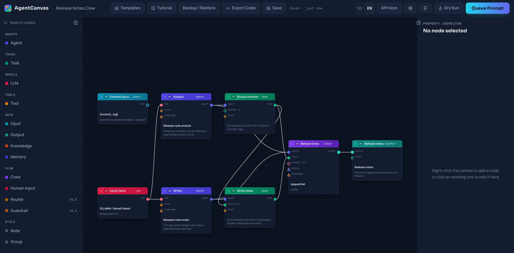
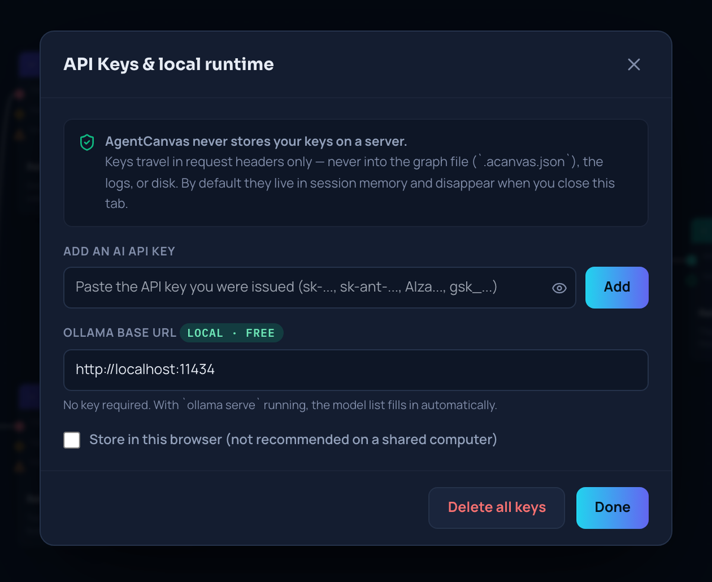
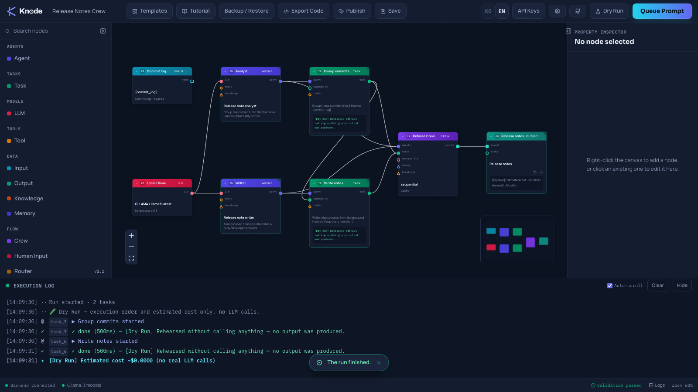
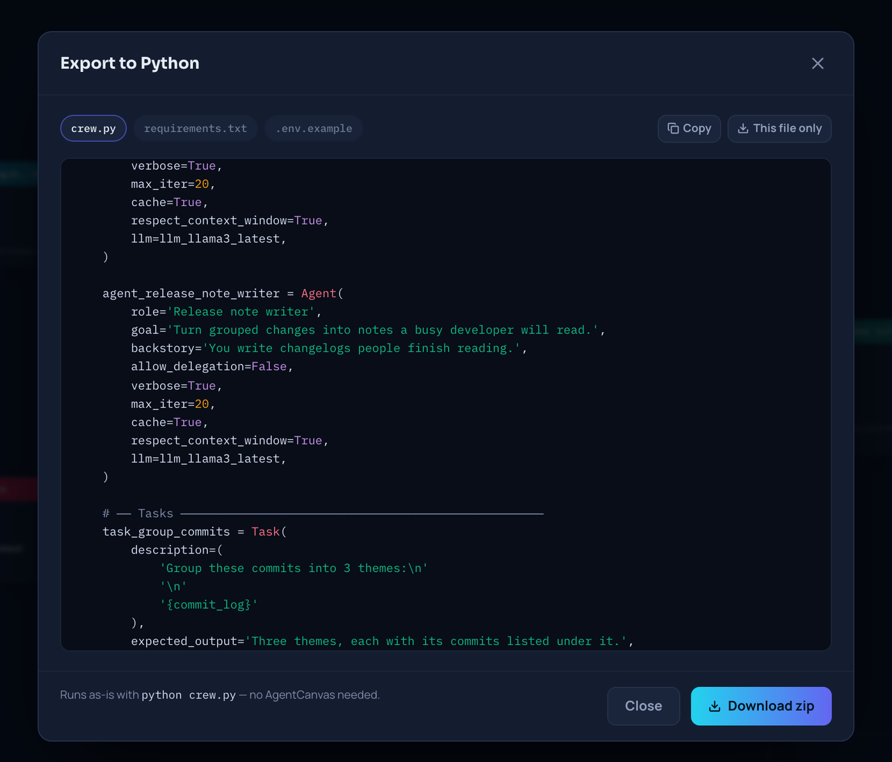

<div align="center">

# AgentCanvas

### Wire up a CrewAI agent team on a canvas — and watch it actually run.

[](LICENSE) [](https://github.com/crewAIInc/crewAI) [](#tested) [](#your-keys-stay-yours) [](#run-it-for-free-locally)

[Quick start](#quick-start) · [What you get](#what-you-get) · [Node catalog](#node-catalog) · [Templates](#templates) · [How it works](#how-it-works) · [Docs](#documentation)

</div>

<video src="https://github.com/hynwl/agentcanvas/raw/main/docs/media/demo.mp4" controls autoplay loop muted playsinline width="100%" style="border-radius: 8px;"></video>

<div align="center">
<sub><b>One take, played at 1.6×:</b> the canvas flags a missing wire, we connect it, hit <b>Queue Prompt</b>, and a local Llama 3 turns a raw commit log into release notes — live on the graph. No API key. $0.</sub>
</div>

<br>

## Why this exists

CrewAI is a genuinely good way to build multi-agent teams. In Python. Which means every
experiment costs you the same loop: edit the file, run it in a terminal, scroll a wall of
log, guess which agent stalled, edit again. The team you designed only exists in your head
and in the shape of the code.

AgentCanvas makes that team a thing you can look at, change, and watch work.

|  | Writing it in Python | On the canvas |
|---|---|---|
| **Change a prompt** | edit file → re-run → scroll | click the node, type, run |
| **See what's happening** | terminal scrollback | the node lights up, the wire pulses, thoughts and tool calls stream in |
| **Understand a crew someone shared** | read the whole script | open the file, look at it |
| **Hand it off** | "run this repo" | one `.acanvas.json`, or a link |
| **Get out** | — | **Export to Python. It's just CrewAI.** |

Nothing here is a mock. The graph compiles into a real `crewai.Crew` on the backend and
runs it; what you see moving on the canvas is the actual execution reporting back.

## Quick start

**Download the app — no terminal, no Docker, no Python:**

Grab the latest installer from [Releases](https://github.com/hynwl/agentcanvas/releases/latest)
and run it. The bundled Python/CrewAI runtime starts itself in the background.

- **macOS (Apple Silicon)** — `AgentCanvas-<version>-arm64.dmg`
- **Windows** — `AgentCanvas Setup <version>.exe`

> **Unsigned build.** We don't have an Apple Developer or Windows code-signing certificate
> yet, so your OS will warn you — once, on first launch only. That's expected, not a sign
> anything's broken:
>
> - **macOS**: don't double-click `AgentCanvas.app` — that hits Gatekeeper's "AgentCanvas
>   can't be opened because Apple cannot check it for malicious software," with no way past
>   it. Instead, **right-click (or Control-click) the app → Open → Open** again in the
>   confirmation dialog. Needed once; it opens normally after that.
> - **Windows**: SmartScreen shows "Windows protected your PC." Click **More info**, then
>   **Run anyway**.

First launch shows a one-time tour pointing at your data folder and whether it found a
local Ollama — the same $0 path as [below](#run-it-for-free-locally). This is an additional
distribution channel; Docker and running from source (below) work exactly the same as ever.

**Docker — one command, nothing to install but Docker:**

```bash
git clone https://github.com/hynwl/agentcanvas.git
cd agentcanvas
cp .env.example .env
docker compose up
```

Open **[localhost:3000](http://localhost:3000)**. Pick a template, or start blank.

**From source** — needs Node 18.18+ and **Python 3.12** (CrewAI 1.15 will not install on
3.9, still the default `python3` on macOS):

```bash
# frontend — http://localhost:3000
cd frontend && npm ci && npm run dev

# backend (separate terminal) — needed to execute a crew
cd backend
python3.12 -m venv .venv && .venv/bin/pip install -r requirements.txt
.venv/bin/uvicorn app.main:app --reload --port 8000
```

**Want a first run that costs nothing?** Have [Ollama](https://ollama.com) running
(`ollama serve && ollama pull llama3`) and open the **Local-only Summarizer** template — no API
key, no account, no spend. That is the exact setup in the demo above.

> The canvas works with the backend down. You can build, validate, export and share graphs
> entirely client-side; the backend is only needed to *run* one.

## What you get

### Build the crew by wiring it



- **14 node types** — LLM, Agent, Task, Tool, Crew, Input, Output, Knowledge, Memory,
  Human Input, Router, Guardrail, Note, Group.
- **Typed sockets that refuse bad wiring.** An `llm` output physically will not drop into
  an `agent` socket. Cycles are rejected. Missing required links surface in the status bar
  *before* you spend a token.
- **Every CrewAI field is a form control** — role, goal, backstory, `expected_output`,
  `max_iter`, `process`, delegation, caching. No YAML, no dict-typing from memory.
- **`Ctrl+K`** for the command palette; right-click the canvas for a searchable
  add-node menu.

### Watch it run, on the graph

The backend streams Server-Sent Events while CrewAI works, and the canvas spends them:
node status rings, particles moving along the wires in real execution order, agent
thoughts and tool calls in the console, per-task output previews pinned to the task that
produced them, elapsed time and token cost in the header.

When something fails, the node that failed is the one wearing the error — not line 214 of
a scrollback buffer.

### Your keys stay yours



- **BYOK.** Keys live in your browser — session memory by default, LocalStorage only if you
  tick the box. They travel as request headers and are never persisted server-side.
- A **log-masking layer** strips key-shaped strings from every log line as a second line of
  defense, and the export path runs a **secret scanner** so you can't accidentally ship a
  key inside a shared graph.
- LLM nodes store the **name** of a key slot, never its value — so `.acanvas.json` files are
  safe to commit, share and import. Register several keys per provider (work vs. personal,
  or one per self-hosted endpoint) and pick one per node.
- **6 providers**: OpenAI, Anthropic, Gemini, Groq, Ollama, and anything OpenAI-compatible.

### Run it for free, locally

AgentCanvas auto-detects a running Ollama instance, fills in the model list, and marks the
templates that need no key at all. Fully offline, $0, no account — the demo at the top of
this page is exactly that path.

### Rehearse before you spend



**Dry Run** walks the whole graph, reports the execution order CrewAI will take and an
estimated cost, and calls no LLM at all. Useful when the crew is big enough that "just try
it" has a price tag.

### Stop, or step in, mid-run

**Stop** cancels a run in flight. Any task can be marked *human review when finished* —
the run pauses, the browser asks you for feedback, and CrewAI continues with it. No
terminal prompt to babysit.

### Leave whenever you want



**Export to Python** turns any graph into a standalone `canvas.py` + `requirements.txt` +
`.env.example`. It runs with `python canvas.py` and never imports AgentCanvas. That is the
whole point: this is a faster way to build a CrewAI crew, not a place your work gets
stuck.

Graphs also round-trip as a single `.acanvas.json`, or compress into a share link
(automatic file fallback past ~3 KB).

## Node catalog

| Category | Nodes |
|---|---|
| **Agents** | `Agent` — role, goal, backstory, delegation, iteration caps |
| **Tasks** | `Task` — description, expected output, dependencies, async, human review |
| **Models** | `LLM` — provider, model, temperature, key slot, base URL |
| **Tools** | `Tool` — 8 built-ins: web search, scraping, file read, directory read, website RAG, CSV search, YouTube search, custom HTTP |
| **Data** | `Input` (run parameters), `Output` (rendered result), `Knowledge` (RAG sources), `Memory` |
| **Flow** | `Crew` (sequential / hierarchical), `Human Input`, `Router` *(v1.1)*, `Guardrail` *(v1.1)* |
| **Utils** | `Note`, `Group` |

## Templates

Every template opens on the canvas, editable — nothing is a black box. Names, prompts and
agent roles come through in whichever language the UI is set to.

| Template | What it does | Keys needed | Est. cost |
|---|---|---|---|
| **Hello Crew** | 1 agent, 1 task — first success in under 3 minutes | OpenAI | ~$0.0002 |
| **Blog & SEO Crew** | Research → write → edit, sequential | OpenAI, Serper | ~$0.003 |
| **Market Research Report** | 3 independent researchers → analyst synthesis | OpenAI, Serper | ~$0.004 |
| **YouTube Script Pipeline** | Outline → script → hook optimization | OpenAI | ~$0.003 |
| **Local-only Summarizer** | Fully offline via Ollama | **none** | **$0** |

Save your own crews as templates too — they show up in the same gallery.

## How it works

```
┌─ frontend/ ───────────────────────┐        ┌─ backend/ ──────────────────────┐
│  Next.js 15 · React Flow          │  POST  │  FastAPI                        │
│  canvas · inspector · console     │ ─────► │  compiler: JSON → crewai.Crew   │
│  validation · export · autosave   │        │  runtime: execute + stream      │
│  keys (browser only) ─────────────┼─header─┤  SSE events ◄── CrewAI callbacks│
└───────────────────────────────────┘ ◄─SSE─ └─────────────────────────────────┘
        │                                              │
   LocalStorage                                   Ollama / OpenAI / Anthropic
   .acanvas.json                                  Gemini / Groq / compatible
```

The two halves are independently useful. The canvas persists to LocalStorage and is fully
functional offline; the backend is a plain REST + SSE API if you'd rather drive it from
something else.

Pinned to **CrewAI 1.15.18** — and the health endpoint reports version drift, because
CrewAI's real API and its docs disagree in enough places that we keep
[a recon document](docs/CREWAI_RECON.md) about it.

## Tested

| Suite | Count |
|---|---|
| Backend (pytest) | 828 |
| Frontend unit (vitest) | 513 |
| End-to-end (Playwright) | 36 |

All three run on every push. Contrast ratios, keyboard paths and reduced-motion behavior
are asserted in tests, not eyeballed.

## Documentation

- [`CONTRIBUTING.md`](CONTRIBUTING.md) — dev setup, drift guards, test commands, PR conventions
- [`docs/ERRORS.md`](docs/ERRORS.md) — every `AC-Exxx` code, what it means, how to fix it
- [`docs/ACCEPTANCE.md`](docs/ACCEPTANCE.md) — the release checklist, and how each item was actually verified
- [`docs/CREWAI_RECON.md`](docs/CREWAI_RECON.md) — where CrewAI's real API diverges from its docs

## License

[AGPL-3.0](LICENSE). Use it, fork it, run it inside your company freely. If you offer a
modified version as a network service, that version's source has to be available too.

<div align="center"><sub>UI available in English and 한국어.</sub></div>
