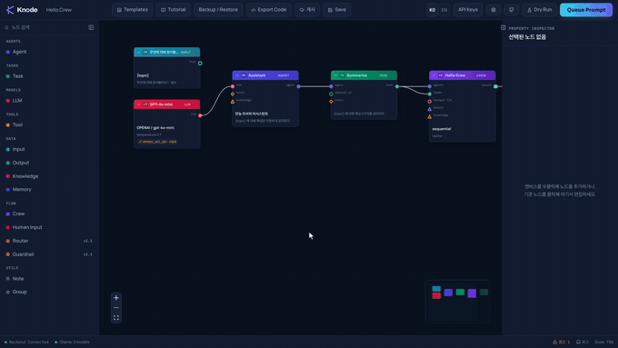

# AgentCanvas

Build [CrewAI](https://github.com/crewAIInc/crewAI) crews by wiring nodes on a
canvas — LLMs, Agents, Tasks, Tools — and watch them run live: particles flow
along the wires you just connected, in the order the crew is actually executing.



No backend, no signup, to start editing — the canvas runs entirely client-side
and autosaves to your browser. Bring your own API key (or run a template
against a local Ollama model for free) when you're ready to execute.

## Quick start

**Docker (recommended — one command, nothing to install but Docker):**

```bash
git clone https://github.com/agentcanvas/agentcanvas.git
cd agentcanvas
cp .env.example .env
docker compose up
```

Open [http://localhost:3000](http://localhost:3000). Pick a template from the
gallery, or start blank.

**From source** (needs Node 18.18+ and Python 3.12 — CrewAI 1.15 does not
install on 3.9, which is still the default `python3` on macOS):

```bash
# frontend — http://localhost:3000
cd frontend && npm ci && npm run dev

# backend (separate terminal) — needed to actually execute a crew
cd backend
python3.12 -m venv .venv && .venv/bin/pip install -r requirements.txt
.venv/bin/uvicorn app.main:app --reload --port 8000
```

The canvas works with the backend down — you can still build, validate, and
export graphs. Running a crew needs the backend up.

## What it does

- **Visual crew builder** — 14 node types (LLM, Agent, Task, Tool, Crew,
  Input/Output, Knowledge, Memory, Group, Note, ...) with typed sockets that
  physically block incompatible connections.
- **Real execution, not a mock** — the graph compiles into an actual
  `crewai.Crew` on the backend and runs it; events stream back over SSE so
  node status, agent thoughts, tool calls, and token usage show up live.
- **BYOK** — API keys live in your browser (session memory by default, opt-in
  LocalStorage) and are sent as request headers only. The server never
  persists them; a log-masking layer strips key-shaped strings from every log
  line as a second line of defense.
- **Local-first option** — auto-detects a running Ollama instance and lets you
  run crews against a local model for $0, no key required.
- **Dry run** — rehearse the execution order and estimated cost without
  calling any LLM.
- **Human-in-the-loop** — pause a running crew for manual review/feedback
  mid-task, from the browser, no terminal required.
- **Export to Python** — turn any graph into a standalone `crew.py` you can
  run without this app at all.
- **Share links** — a graph compresses into a URL; paste it, load it, no file
  needed (falls back to file export past ~3KB).
- **5 starter templates**, including one that requires no API key at all.

## Templates

| Template | What it does | Keys needed | Est. cost |
|---|---|---|---|
| Hello Crew | 1 agent, 1 task — first success in under 3 minutes | OpenAI | ~$0.002 |
| SEO 블로그 작성팀 | Research → write → edit, sequential | OpenAI, Serper | ~$0.02 |
| 시장 조사 리포트 | 3 parallel researchers → analyst synthesis | OpenAI, Serper | ~$0.03 |
| YouTube 대본 파이프라인 | Outline → script → hook optimization | OpenAI | ~$0.015 |
| 로컬 전용 요약봇 | Fully offline via Ollama | none | $0 |

## Documentation

- [`CONTRIBUTING.md`](CONTRIBUTING.md) — dev setup, drift guards, test commands, PR conventions
- [`docs/ERRORS.md`](docs/ERRORS.md) — every `AC-Exxx` error code, what it means, how to fix it
- [`docs/ACCEPTANCE.md`](docs/ACCEPTANCE.md) — the release checklist, item by item, with how each one was actually verified
- [`docs/CREWAI_RECON.md`](docs/CREWAI_RECON.md) — where CrewAI's actual API diverges from its docs (relevant if you're touching the compiler or runtime)

## Architecture

```
frontend/   Next.js 15 + React Flow — the canvas, entirely client-side
backend/    FastAPI — compiles graphs into crewai.Crew, executes, streams SSE
design/     Design tokens + the locked visual reference this UI is built from
docs/       Spec, CrewAI API recon notes, error code reference
```

Frontend and backend are independently useful: the canvas persists to
LocalStorage and works with the backend offline; the backend is a plain REST +
SSE API if you want to drive it from something else.

## License

[AGPL-3.0](LICENSE).
